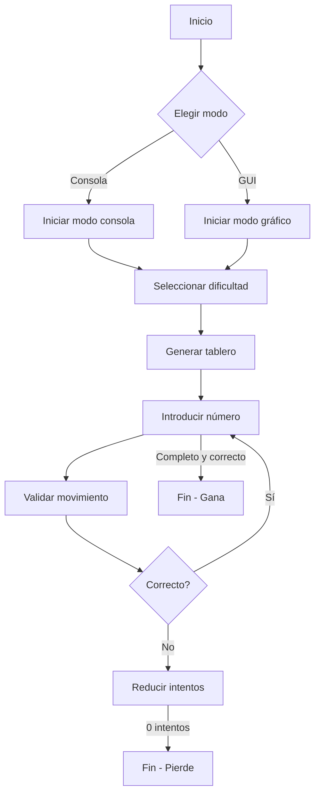
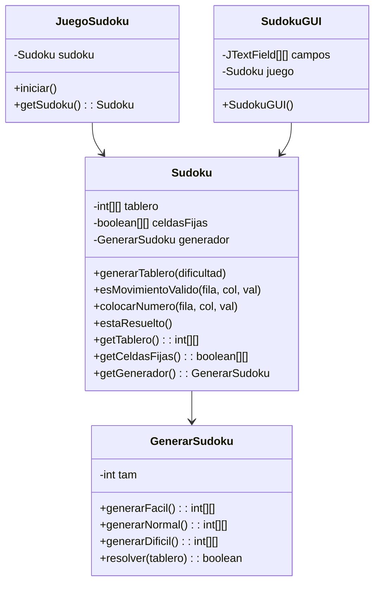
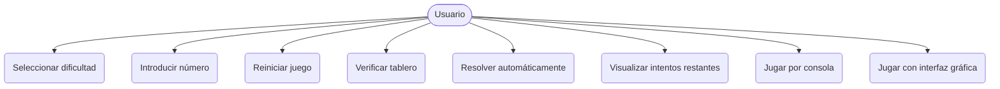

# 📘 Proyecto Sudoku – Entrega Documentación

## 1. Descripción del proyecto

Este proyecto consiste en la creación de un juego de Sudoku desarrollado en Java. El juego permite al usuario jugar tanto desde una interfaz gráfica Swing como desde consola. La aplicación genera tableros aleatorios con distintos niveles de dificultad (fácil, normal y difícil), valida los movimientos del jugador y comprueba si se ha resuelto correctamente.

---

## 2. Objetivos SMART

| Objetivo | Descripción |
|---------|-------------|
| **S** (Específico) | Crear un juego funcional de Sudoku en Java que permita jugar en consola o interfaz gráfica. |
| **M** (Medible) | Completado cuando el jugador puede generar tableros, introducir números, validarlos y resolverlos. |
| **A** (Alcanzable) | Utilizando Java y JUnit como entorno de pruebas, dentro de un IDE como IntelliJ. |
| **R** (Relevante) | Refuerza la comprensión de estructuras, interfaz, entrada/salida, validación y testing. |
| **T** (Temporal) | El desarrollo completo y documentación se realiza dentro del trimestre asignado. |

---

## 3. Requisitos funcionales

| ID | Descripción | Prioridad | Estado |
|----|-------------|-----------|--------|
| RF1 | El usuario puede seleccionar el nivel de dificultad. | Alta | ✅ |
| RF2 | El sistema genera un tablero de Sudoku válido. | Alta | ✅ |
| RF3 | El usuario puede introducir números en celdas vacías. | Alta | ✅ |
| RF4 | El sistema valida si el movimiento es correcto. | Alta | ✅ |
| RF5 | Se permite un máximo de 5 errores antes de perder. | Media | ✅ |
| RF6 | El sistema indica cuándo se ha completado correctamente el Sudoku. | Alta | ✅ |
| RF7 | El juego puede iniciarse desde consola o interfaz gráfica. | Alta | ✅ |
| RF8 | El sistema muestra errores visuales en la GUI. | Media | ✅ |
| RF9 | El usuario puede reiniciar el juego o resolver automáticamente. | Media | ✅ |
| RF10 | Se mide el tiempo de juego. | Baja | ✅ |

---

## 4. Requisitos no funcionales

| ID | Descripción | Categoría | Nivel Objetivo | Estado |
|----|-------------|-----------|----------------|--------|
| RNF1 | Interfaz clara y comprensible para el usuario. | Usabilidad | Alto | ✅ |
| RNF2 | Modularidad del código separando lógica y GUI. | Mantenibilidad | Alto | ✅ |
| RNF3 | Pruebas automáticas con JUnit. | Calidad | Medio | ✅ |
| RNF4 | Documentación clara y estructurada. | Documentación | Alto | ✅ |
| RNF5 | Compatibilidad con JDK 17+. | Portabilidad | Alto | ✅ |

---

## 5. Casos de uso principales

---

## 6.1 Matriz de trazabilidad

| Requisito | Objetivo Relacionado | Prueba asociada |
|-----------|----------------------|------------------|
| RF1 - RF4 | S, M, A              | JUnit: `SudokuTest` |
| RF5       | M, T                 | JUnit: `SudokuTest` |
| RF7       | S, R                 | Manual + `Main` |
| RF8 - RF10| A, R, T              | JUnit + visual |

## ~~~~6.2 Matriz de Trazabilidad Detallada

| Requisito | Método(s)                             | Clase           | Test Relacionado            |
|-----------|----------------------------------------|------------------|-----------------------------|
| RF1       | generarTablero(String)                | Sudoku           | SudokuTest, JuegoSudokuTest |
| RF2       | generarFacil(), generarNormal(), generarDificil() | GenerarSudoku | GenerarSudokuTest          |
| RF3       | colocarNumero(int, int, int)          | Sudoku           | SudokuTest                  |
| RF4       | esMovimientoValido(int, int, int)     | Sudoku           | SudokuTest                  |
| RF5       | colocarNumero() + lógica interna      | SudokuGUI, Sudoku | SudokuTest                 |
| RF6       | estaResuelto()                        | Sudoku           | SudokuTest                  |
| RF7       | iniciar()                             | JuegoSudoku      | JuegoSudokuTest             |
| RF8       | comprobarTablero()                    | SudokuGUI        | Visual/manual               |
| RF9       | botones GUI                           | SudokuGUI        | Visual/manual               |
| RF10      | temporizador                          | SudokuGUI        | Visual/manual               |

---

## 7. Conclusión

Este proyecto ha permitido consolidar el uso de Java en programación modular, pruebas unitarias con JUnit y desarrollo de interfaces con Swing. Se ha demostrado la capacidad para cumplir con todos los requisitos funcionales y no funcionales definidos inicialmente, ofreciendo una solución robusta y educativa.

---

## 📐 Diagrama de clases (UML)

---

## 🎯 Diagrama de Casos de Uso (UML)

---

